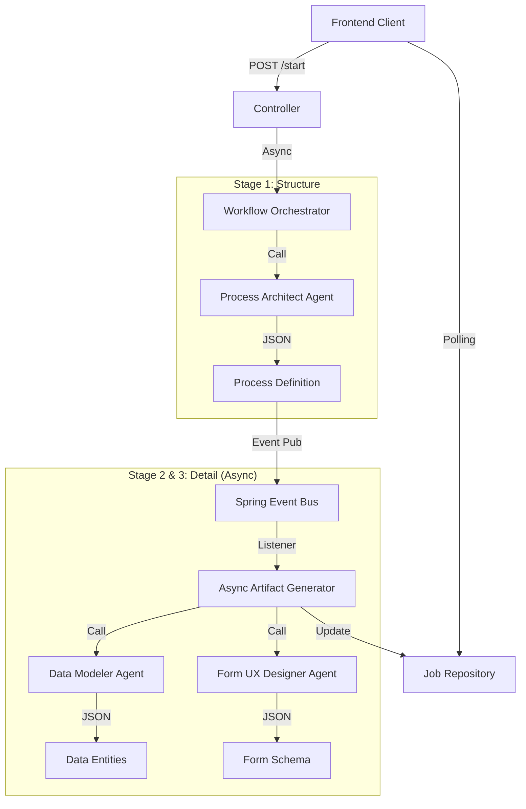

# 🏛️ AI-Native Workflow Architect (Backend)

**"More than just a generator—a true AI Co-Architect."**

> 🔗 **Paired Frontend Repository:** [ai-workflow-designer-fe](https://github.com/your-username/ai-workflow-designer-fe)  
> (The frontend client runs on port 5173 and proxies API requests to this backend)

This project is an intelligent backend service that transforms natural language requirements into executable business processes, data models, and user interfaces. Design complex enterprise application structures with a single prompt, and collaborate in real-time to refine and evolve them.

## 🚀 Key Features

### 1. **⚡ Event-Driven Incremental Generation**

No more waiting. Visual results for the process skeleton are provided immediately (approx. 20 seconds) after completion, while data and forms are generated asynchronously in the background.
- **Process First**: Instant visualization of the workflow structure.
- **Optimistic UI**: Real-time "Analyzing Data..." status updates, with automatic completion notifications.

### 2. **🧠 Atomic Data & Lineage**

Say goodbye to vague data like "Leave Application Form." The AI imagines the actual UI to decompose data into atomic fields such as `StartDate` and `LeaveType`.

- **Atomic Explosion**: Precise data modeling at the field level, not the task level.
- **Source Tracking**: Every data variable remembers the node (`sourceNodeId`) where it was created.

### 3. **🤖 Hybrid Suggestion Engine**

The AI doesn't just build blindly. When you select a node, it analyzes the current context to suggest the "Next Best Action."

- **Smart Binding**: Suggests actions like "Send Email" with the `applicantEmail` variable from the previous step automatically mapped (`#{node.email}`).
- **Explicit Gateway**: Automatically generates branching logic (Gateway) after approval nodes.

### 4. **🛡️ Type Safety & Polymorphism**

- **Unified Configuration**: Manages settings for diverse nodes like `UserTask`, `ServiceTask`, and `Gateway` under a single unified structure (`NodeConfiguration`), maximizing frontend interoperability.

## 🏗️ Architecture

This system follows a **3-Stage Event Pipeline** structure based on **Spring Boot** and **LangChain4j**.



### **🛠️ Tech Stack**

- **Core**: Java 17, Spring Boot 3.x
- **AI**: LangChain4j, OpenAI (GPT-4o-mini optimized)
- **Data**: In-Memory ConcurrentHashMap (Prototype)
- **API**: RESTful API (Polling & On-Demand Suggestion)

## **🔌 API Guide (Quick Start)**

### Prerequisites

* Java 17+
* Maven
* OpenAI API Key

### 1. Configuration

Update `application.properties` with your OpenAI API Key:

```Properties
openai.api-key=sk-YOUR-KEY-HERE
```

### 2. Run Application

The server will start on port `8080`.

```bash
./mvnw spring-boot:run
```

### 3. Start Process Generation

```HTTP
POST /api/copilot/start
Content-Type: application/json

{
   "userPrompt": "Create an expense claim process where claims over $1,000 require manager approval, otherwise auto-approved."
}
```

### 4. Check Progress (Polling)

```HTTP
GET /api/copilot/status/{jobId}
```

* Response Example (In Progress):

```json
{
    "state": "PROCESSING",
    "lastUpdatedStage": "PROCESS",
    "stageDurations": { "PROCESS": 21000 },
    "totalElapsedMillis": 21500
}
```

### 5. Quick Test (Using .http Client)

You can test all APIs directly within your IDE (IntelliJ IDEA, VS Code) using the provided HTTP file.

1. Open `src/test.http`.

2. Click the Run (▶️) button next to each request.

3. The request scenarios are pre-configured to:
   - Start a job (Mode A/B
   - Automatically capture the `jobId`
   - Poll the status using the captured `jobId`

## 📂 Project Structure

* `agent/`: AI Persona definitions (ProcessArchitect, DataModeler, etc.)
* `dto/`: Strongly typed data models agreed upon with the frontend (NodeConfiguration, etc.)
* `event/`: Spring Event classes for asynchronous processing
* `service/`: Business logic and orchestration (WorkflowOrchestrator, AsyncArtifactGenerator)
